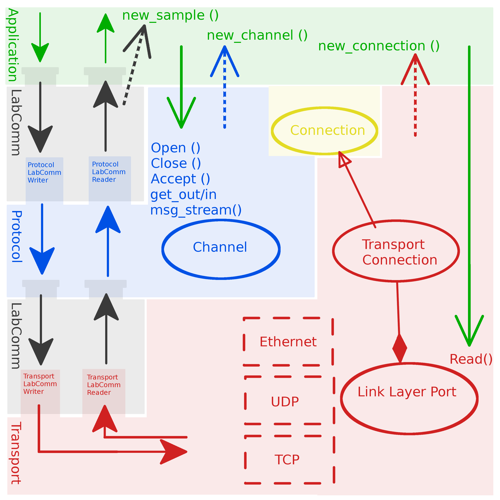
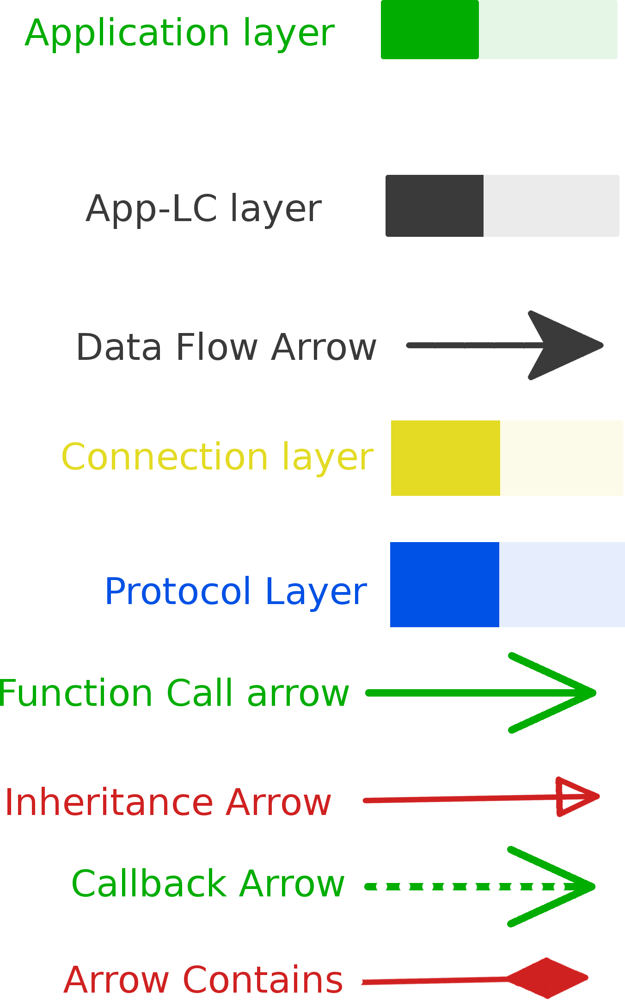

# Firefly
A research project conducted at Robotics Lab at Lund University.

Upstream: https://lgit945.cs.lth.se/robotlab/firefly

## What is Firefly?

Legend: 

Firefly is a framework and protocol that is used to communicate serialized data
between two nodes. It builds upon the Labcomm protocol, which is by design a one
way protocol, and extends it to enable two way communication over different
transport medium.

The protocol specification is fairly simple by design to avoid any overhead when
used in a setting with real time demands. There is a BNF-description of the
protocol.

There are reference implementations for three different application examples as
well as four different transport mediums (UDP and Ethernet on Posix and
FreeRTOS/Stellaris).

## WARNING
The library's interface is still not set in stone and very prone to changes. Do
_NOT_ consider this as stable yet!

